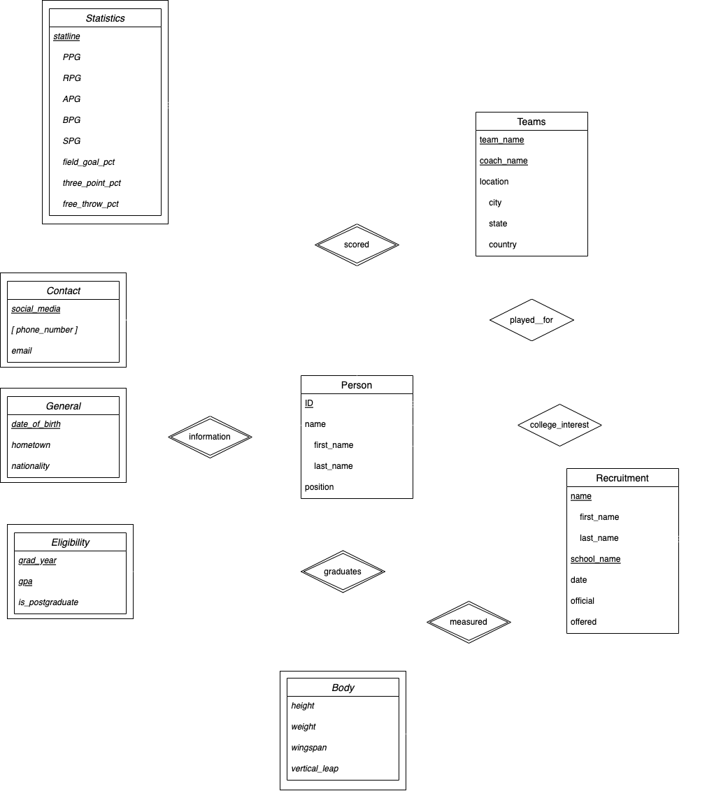

Sean Okpoebo

***
**Domain Description**
***
*College Recruitment Database*:
This database is designed to store and manage information related to the recruitment of high school athletes by colleges. It includes student information, their statistical information, and whether or not these students have received offers from colleges.

***
**Entities and Relationships**
***
_Each of these entities will be assigned an easily-trackable identifier, to make accession simpler.
_
_Person_
The representation of the high-school recruit. This entity contains the name, and position of each player, among additional information. 

_Teams_
The representation of the teams which these players played for. This contains the name, location, and coach of each team.

_Statistics_
The representation of the player's statline from while playing in high school. Note: the statstics can be abbreviated.

- Points per game : PPG
- Assists per game : APG
- Rebounds per game : RPG
- Blocks per game : BPG
- Steals per game : SPG

_Recruitment_
The representation of colleges offering scholarships and campus visits to certain players. This contains the player name, offering school, and if an offer is extended.

_Eligibility_
The entity that withholds information regarding a players graduation year, gpa, and post-graduate status.

_Body_
The entity that stores unique player physical makeups concerning height, weight, wingspan, and vertical jump. Height, wingspan, and vertical is measured in inches, and weight in pounds.

_Contact_
The entity representing where the player's contact information can be found. Phone numbers, emails, and social media handles are stored here.

***
**E-R Diagram**
***

***
**Relation Schema** in Parenthetical Form
***
(primary keys are **bold**)

person(**ID**, first_name, last_name, position, date_of_birth, grad_year, gpa, team_name)   

general(**date_of_birth**, hometown, nationality) 

body(**ID**, height, weight, wingspan, vertical_leap) 

statistics(**ID**, ppg, rpg, apg, bpg, spg, field_goal_pct, three_point_pct, free_throw_pct) 

contact(**ID**, social_media_id, email) 

numbers(**contact_id**, phone_number) 

teams(**team_name**, coach_name, city, state, country) 

eligibility(**grad_year**, **gpa**, is_postgraduate) 

recruitment(**player_visit_id**, first_name, last_name, school, date_of_visit, official, offered) 

socials(**social_media_id**, Snapchat, Instagram, Twitter)

_For each of these functional dependencies, none end up being non-trivial, and each primary key uniquely identifies tuples within each relation._

***
**Transaction and Query Executions**
***
